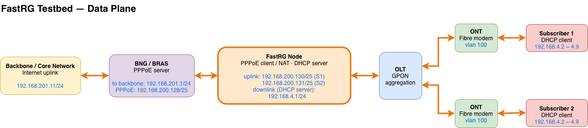

# FastRG(Fast Residential Gateway) system (Data plane node)

## Introduction:

- This is a C based high throughput open source software-defined residential gateway system data plane, part of the FastRG system.
- The FastRG system can be used as a residential gateway connected with BRAS(Broadband Remote Access Server) to provide PPPoE client, NAT and DHCP server function for subscribers.
- The FastRG system supports multiple PPPoE sessions, each PPPoE session is mapped to a unique VLAN ID in data plane.
- The FastRG system support DHCP server and NAT function for subscribers behind the FastRG system.
- For service provider, the FastRG system can help to reduce the CAPEX and OPEX of deploying residential gateway for subscribers by just deploying an ONT with L2 bridge in subscriber's home.
- Because of the centralized management of Residential Gateway system, service provider can easily maintain and update the FastRG system without going to subscriber's home. This can greatly reduce the network security risks of service provider.
- The FastRG system also provides both a command line interface and a [central controller](https://github.com/FastResidentialGateway/fastrg-controller) for administrator to manage. Administrator can easily deploy the FastRG system in a cloud native environment with Kubernetes and Docker image.
- The FastRG system data plane is implemented based on DPDK library to achieve high performance packet processing.

## System required:

- DPDK capable NIC with at least 2 ports
	- Suggest to use Intel E800 or X700 series NICs to acquire best performance.
- 8GB RAM
	- The memory size is depended on the number of subscribers, please refer to note 2 in "Note" section.
- At least 6 CPU cores.

## How to use:

- The FastRG system is consisted of control plane and data plane, the [FastRG controller](https://github.com/FastResidentialGateway/fastrg-controller) and this repository.
	- The control plane is used to manage the data plane node and network functions. 
	- The data plane is used to forward packets between LAN and WAN port.
- User can deploy both control plane and data plane or just data plane only.
	- The control plane and data plane can run on the same server or different servers.
	- The control plane and data plane communicate with each other through Etcd and gRPC.
- If user wants to deploy the data plane only, the data plane provides Unix domain socket to communicate with built-in CLI tool, user can modify the Unix socket path in ***config.cfg*** file.
- In the data plane, 2 DPDK ethernet ports are needed, the first one is used to Rx/Tx packets to LAN port and the second one is used to Rx/Tx packets to WAN port.
- To run the FastRG system data plane from scratch, please follow the steps below:

Git clone this repository

	# git clone https://github.com/w180112/fastrg-node.git
	# TAG=$(git describe --tags --abbrev=0)
    # git checkout $TAG

Type

	# cd fastrg-node
	# git submodule update --init --recursive

For first time build, please use ./essentials.sh to install dependencies and then run ./boot.sh to build DPDK library, libutil and FastRG

	# ./boot.sh

For just FastRG build, clean, install and uninstall, please use makefile

	# make && make install
	# make clean && make uninstall

Then

	# fastrg <dpdk eal options>

e.g.

	# fastrg -l 0-11 -n 4 -a 0000:04:00.0 -a 0000:08:00.0 

For using FastRG system data plane in Docker,

	# docker build --no-cache -t fastrg:latest .

Or

    # docker pull ghcr.io/fastresidentialgateway/fastrg-node:latest

Then

	# mount -t hugetlbfs -o pagesize=1G none /dev/hugepages1G
	# docker run -d --net=host --privileged -v /sys/bus/pci/devices:/sys/bus/pci/devices \
	-v /sys/kernel/mm/hugepages:/sys/kernel/mm/hugepages -v /sys/devices/system/node:/sys/devices/system/node -v /dev:/dev -v /etc/fastrg:/etc/fastrg fastrg:latest fastrg -l 0-7 -n 4 -a 0000:04:00.0 -a 0000:08:00.0

For Intel E800 series NICs, please use this command to start Docker container

	# docker run -d --net=host --privileged -v /sys/bus/pci/devices:/sys/bus/pci/devices \
	-v /sys/kernel/mm/hugepages:/sys/kernel/mm/hugepages -v /sys/devices/system/node:/sys/devices/system/node -v /dev:/dev -v /etc/fastrg:/etc/fastrg -v/lib/firmware/updates/intel/ice/ddp/:/lib/firmware/updates/intel/ice/ddp/ -v /lib/firmware/intel/ice/ddp:/lib/firmware/intel/ice/ddp fastrg:latest fastrg -l 0-7 -n 4 -a 0000:04:00.0 -a 0000:08:00.0

For Intel X700 series NICs, please remember to include DDP file in Docker container and specify the DDP file in ***config.cfg*** file to enable PPPoE RSS feature.

### SDN mode(Control plane + Data plane)

Update the endpoints of Etcd server and gRPC server address in configuration file ***config.cfg***.

Please refer to FastRG controller web page to manage the system.
 - The CLI tool ***fastrg-cli*** can also be used to connect to the FastRG system data plane while using SDN mode.

### Standalone mode(Only data plane)

If there is only FastRG system data plane is deployed, after data plane started, user can use cli tool ***fastrg-cli*** to connect to the system and input "?" command to show available commands.

To configure PPPoE subscriber account, DHCP server pool and VLAN ID mapping, please refer to command ***config***.

	FastRG> config add user 1 vlan 3 pppoe account admin password passwd dhcp pool 192.168.3.2~192.168.3.201 subnet 255.255.255.0 gateway 192.168.3.1
	FastRG> config del user 1

### Example CLI commands:
Use command ***exec*** to determine which user start/stop a PPPoE connection, e.g.:

To start specific subscriber 1 PPPoE connection and DHCP server.

	FastRG> exec hsi start 1

To disconnect specific subscriber 1 PPPoE connection and DHCP server.

	FastRG> exec hsi stop 1

To show current PPPoE connection status.

	FastRG> show hsi

To show current DHCP server status.

	FastRG> show dhcp

To show current system statistics.

	FastRG> show system info

To configure SNAT port forwarding for specific subscriber 1.

	FastRG> config add user 1 snat eport 55688 dip 192.168.3.2 iport 8080

To capture subscriber 1's WAN-side packets to a pcap file (optionally filtered).

	FastRG> exec pdump start WAN subscriber 1 filter "vlan and tcp port 80"
	FastRG> exec pdump stop WAN subscriber 1

See [docs/packet-capture.md](./docs/packet-capture.md) for per-subscriber CLI capture and host `dpdk-dumpcap` usage.

For hugepages, NIC binding and other system configuration, please refer to DPDK documentation: [DPDK doc](http://doc.dpdk.org/guides/linux_gsg/)

## Note:

1. Subscriber devices behind FastRG should use DHCP to get IP address or set the default gateway address to their end device.
	- The DHCP ip address pool can be configured via control plane or FastRG CLI.
2. FastRG automatically computes its maximum subscriber capacity from the free DPDK hugepage heap at startup. It reserves 512 MiB for packet capture and runtime allocations, then **measures what a subscriber actually costs** and divides the rest by it. The measurement is printed in the startup log and exported as `fastrg_node_subscriber_cost_bytes` gauge.
	- All subscriber resources are fully preallocated at startup, so increasing the hugepage allocation increases the computed capacity. Restart FastRG after changing the hugepage allocation.
	- The resulting capacity is clamped to the supported range of 1–2000 subscribers and is exposed as the `fastrg_node_max_user_count` metric.
3. In data plane, all packets received at FastRG system should include a single tag vlan.
4. All DPDK EAL lcores should be on the same CPU socket.
5. The FastRG node supports PPPoE RSS while using Intel E800 and X700 series NICs. For every two more CPU cores, the FastRG node uses 1 more Rx queue pair for LAN and WAN port. Minimum Rx queue count is 2, the maximum is 16. 
	- For E800, please replace DDP package to ice_comms.pkg in /lib/firmware/updates/intel/ice/ddp/ and /lib/firmware/intel/ice/ddp/ and rename it to ice.pkg to enable PPPoE RSS feature. Th DDP package can be download from https://www.intel.com/content/www/us/en/download/19660/intel-ethernet-800-series-dynamic-device-personalization-ddp-for-telecommunication-comms-package.html
	- For X700, please download latest DDP from https://www.intel.com/content/www/us/en/download/15084/intel-ethernet-adapter-complete-driver-pack.html and specify the DDP package in ***config.cfg*** file to enable PPPoE RSS feature.
6. The FastRG node provides a built-in light weightHTTP server to expose Prometheus metrics at http://<node_ip>:55688/metrics. The metrics include PPPoE session count, DHCP lease count, per-subscriber traffic stats, NIC link state and speed, etc. User can use these metrics to monitor the FastRG system status and performance. For more details about the metrics, please refer to [docs/metrics.md](./docs/metrics.md).

## Test environment:

1. Ubuntu 24.04 with Intel E810, X710, X520 and Mellanox CX4 network card
2. Successfully test control plane and data plane with CHT(Chunghwa Telecom Co., Ltd.) BRAS, [fastrg-bras](https://github.com/FastResidentialGateway/fastrg-bras) and Mikrotik RouterOS PPPoE server.
3. DPDK 24.11

### Testbed topology:

## Test coverage:

Coverage is measured on demand at two levels:

- **Unit**: `make coverage` rebuilds the `UNIT_TEST` tree with gcov instrumentation, runs the C unit suites plus the controller C++ test suite, and writes an lcov report to `coverage/` (module/file summaries and an HTML report), then restores a clean tree.
- **E2E**: `make coverage-e2e-build`, run `e2e_test/run_e2e_test.sh` as usual (must be all-green), then `make coverage-e2e-report`; finish with `make clean && make`. The report writes `coverage/e2e.info` and, when unit data is present, `coverage/combined.info`. See `e2e_test/coverage.mk` for the mechanics and rationale.
- **Per-feature view**: run `make coverage-features` to group functions into product features by name/path rules (`e2e_test/feature_coverage.py`) and print per-feature line/function coverage (`coverage/feature-summary.txt`). It uses `coverage/combined.info` when present, otherwise falls back to the unit tracefile.

| Module | Unit test lines | E2E lines | Combined lines | Combined functions |
|---|---|---|---|---|
| src (core) | 31.8% (1693/5320) | 68.1% (3843/5644) | 70.1% (4211/6008) | 92.8% (220/237) |
| src/pppd | 70.9% (2125/2997) | 70.4% (2083/2958) | 83.4% (2598/3116) | 90.1% (137/152) |
| src/dhcpd | 85.1% (711/835) | 67.6% (554/820) | 86.5% (751/868) | 91.2% (31/34) |
| src/dhcpd6 | 82.4% (291/353) | 84.3% (291/345) | 87.2% (340/390) | 100.0% (19/19) |
| src/nd6 | 87.2% (360/413) | 83.0% (356/429) | 91.6% (438/478) | 100.0% (31/31) |
| src/dnsd | 91.1% (631/693) | 80.0% (495/619) | 91.1% (644/707) | 97.2% (35/36) |
| northbound/grpc | 2.3% (48/2123) | 40.0% (879/2200) | 39.9% (886/2219) | 52.7% (39/74) |
| northbound/controller | 33.3% (668/2003) | 81.5% (1600/1962) | 79.3% (1688/2129) | 90.8% (118/130) |
| northbound/cmdline | 93.8% (15/16) | — | 93.8% (15/16) | 100.0% (1/1) |
| **Total** | **44.3% (6542/14753)** | **67.4% (10101/14977)** | **72.6% (11571/15931)** | **88.4% (631/714)** |

Per-feature view (`make coverage-features`):

| Feature | Lines | Functions |
|---|---|---|
| SNAT/NAT + conntrack | 90.2% (462/512) | 97.9% (47/48) |
| PPPoE control plane | 80.9% (1872/2315) | 85.1% (86/101) |
| PPPoE data plane (encap/decap) | 75.6% (211/279) | 100.0% (8/8) |
| dp core (rx/tx loops, distributor, flow rules) | 49.1% (892/1816) | 81.6% (40/49) |
| DHCP server | 86.5% (751/868) | 91.2% (31/34) |
| DNS proxy | 90.5% (673/744) | 97.4% (38/39) |
| IPv6 neighbor discovery (RA/SLAAC/NDP) | 91.7% (429/468) | 100.0% (31/31) |
| DHCPv6-PD client | 87.2% (340/390) | 100.0% (19/19) |
| IPv6 firewall | 84.9% (129/152) | 100.0% (8/8) |
| MAC/ARP resolution | 84.8% (128/151) | 100.0% (13/13) |
| Metrics/observability | 87.4% (731/836) | 100.0% (43/43) |
| Controller sync (SDN) | 61.2% (3013/4920) | 79.0% (181/229) |
| Config/lifecycle | 60.3% (1687/2796) | 75.8% (100/132) |
| CLI | 88.1% (96/109) | 100.0% (13/13) |

## TODO:

1. Increase unit tests converage
2. Support IGMP/IPTV
